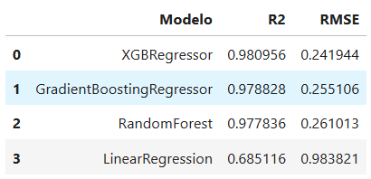

# 🔥 ASHRAE Energy Predictor

Energy consumption prediction on buildings using the **ASHRAE Energy Prediction (Kaggle)** dataset.  
This project integrates several modern technologies for data engineering, machine learning, and visualization.

---

## 📑 Project Workflow

1. **📥 Data Download & Exploration (Kaggle)**
   - ASHRAE Energy Prediction dataset (CSV format).
   - Initial exploration of key variables (meter, site_id, building_id, timestamp, weather, etc.).

2. **🗄️ Transformations in Snowflake (dbt)**
   - Database creation in a Snowflake trial account.
   - Data modeling with **bronze → silver → gold** layers.
   - Basic tests and documentation using `dbt`.
   - Advanced SQL exercises (e.g., *time travel*, *zero-copy cloning*).

3. **☁️ Processing in BigQuery**
   - Migration of the dataset into Google BigQuery.
   - Replication of the layered model (`silver_train`, `gold_features`).
   - Additional transformations to prepare features for ML.

4. **🤖 Machine Learning with BigQuery ML**
   - Models trained directly with SQL:
     - `linear_reg`
     - `boosted_tree_regressor`
     - `dnn_regressor`
   - Evaluation with built-in metrics (R², RMSE).
   - Metrics stored in tables for further visualization.

5. **📊 Visualization in Power BI**
   - Direct connection to BigQuery tables.
   - Interactive dashboard including:
     - Hourly and daily consumption trends.
     - Weekend vs weekday comparisons.
     - Hierarchical drilldown: **site → building → meter**.
     - Statistical insights (percentiles, z-scores).
   - Final dashboard with ML evaluation metrics.

6. **💻 Local Modeling with Python (scikit-learn)**
   - Extraction of 1 million rows from BigQuery.
   - Manual preprocessing: `dropna`, normalization, encoding.
   - Models tested:
     - Linear Regression
     - Random Forest
     - XGBoost
     - Gradient Boosting
   - Results are summarized in the following image:  
     

---

## 📂 Repository Structure
ashrae_energy_predictor/
│── README.md # Project overview
│── python/ # Local notebooks and scripts
│── sql/ # SQL scripts (dbt, Snowflake, BigQuery ML)
│── power_bi/ # Power BI report & dashboard captures
│── results/ # Model metrics and comparison images
└── docs/ # Extended documentation

---

## 🚀 Possible Future Work

- Publish part of the results on **Kaggle**.  
- Add interpretability techniques (e.g., SHAP, feature importance).  
- Automate the pipeline with **dbt + Airflow** in a cloud environment.  
- Deploy dashboards to **Power BI Service** for online reporting.  

---

## 📜 License
This project is released under the **MIT License**.
