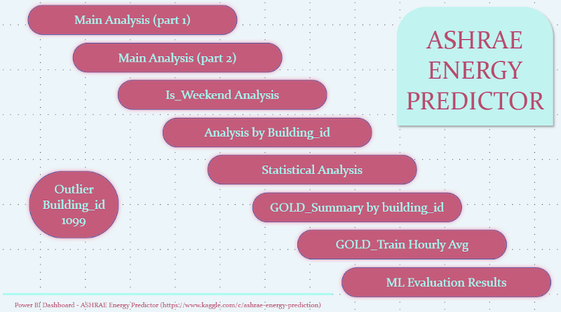

# Power BI Report: ASHRAE Energy Predictor

The Power BI report is provided in two versions:

- **ASHRAE_Energy_Predictor_sample.pbix**  
  This is a reduced version of the original file, containing only 100,000 rows from the `silver_train` dataset (~0.5% of the total 20M rows).  
  ⚠️ The goal of this sample is to allow users to open and explore the dashboard in Power BI Desktop without exceeding GitHub's file size limits.  
  Please note that results and figures may differ from the full dataset.

- **Full version (published in Power BI Service)**  
  The complete report, based on the full dataset (20M rows), is published online and can be accessed via the following public link:  
  👉 [View the full interactive report on Power BI Service](https://app.powerbi.com/view?r=eyJrIjoiZDU3MDMzZTEtNDJmYy00NTBkLWIxNGMtMWZiNjBkNmU2NzhkIiwidCI6ImJlNDY1NWRmLWFjNzMtNDAxZi1hN2FlLTE5OGMzYjcyZDBjNiIsImMiOjh9)

This folder contains the Power BI report developed as the final visualization layer of the project.

## File
- **ashrae_report.pbix** → the complete report connected to BigQuery (silver_train, GOLD tables and ML evaluation results).

## Report Overview
The report is organized into several tabs, each focusing on a different type of analysis:

1. **Index**  
   Navigation page with links to the main report sections.

2. **Building_id 1099**  
   Detailed analysis of the 1099 specific building_id, due to its importance as outlier.
   Users are able to decide if building_id 1099 is included or not along all visualizations of the report

3. **Main Analysis (V1–V2–V3)**  
   - **V1:** Hourly average consumption by site.  
   - **V2:** Daily average consumption by primary building use.  
   - **V3:** Scatter plot of consumption vs air temperature, with selectable color variable.  

4. **Main Analysis (V4–V5–V6)**  
   - **V4:** Hourly average consumption by meter and site.  
   - **V5:** Monthly average consumption by building.  
   - **V6:** Scatter plot of consumption with selectable variable (alternative to V3).

5. **Is_Weekend Analysis**  
   Comparison of energy consumption between weekdays and weekends.

6. **Analysis by building_id**  
   Drill-down navigation: select `site_id → building_id → meter` for detailed consumption.

7. **Statistical Analysis**  
   Application of statistical measures such as percentiles, z-scores, and moving averages.

8. **GOLD_Summary by building**  
   Aggregated results from the `gold_*` tables (building-level summaries).

9. **GOLD_Train_Hourly_avg**  
   Hourly average consumption by building, based on GOLD transformations.

10. **Evaluation Results**  
    Performance metrics of ML models trained in BigQuery, visualized for easy comparison.

## Screenshots
Some highlights of the report:

| Index | Main Analysis | Evaluation Results |
|-------|---------------|--------------------|
|  |  |  |

## Notes
- The report is also published in Power BI Service.  
- For security reasons, the live BigQuery connection is not shared in this repository.  
- The `.pbix` file can be opened and re-connected to a local or cloud data source if needed.
