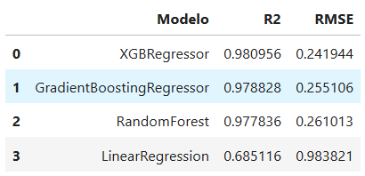

# Python Analysis

This folder contains the **Jupyter Notebook** developed to extend the ASHRAE Energy Predictor project with additional machine learning experimentation outside BigQuery ML.

## Notebook: `ML_ASHRAE.ipynb`
The notebook includes:
- Import of training and evaluation data from BigQuery.
- Preprocessing and feature selection steps.
- Training of several regression models using **scikit-learn** (e.g., Linear Regression, Random Forest, Gradient Boosting).
- Comparison of model performance based on metrics such as **R² score** and **RMSE**.
- Visualization of results for better interpretability.

## Model Comparison
The figure below summarizes the comparison of different models:

This allows to directly evaluate which approaches generalize better than the baseline models trained in BigQuery ML.

## Purpose
The goal of this notebook is to:
1. Validate results obtained in BigQuery ML with a Python environment.
2. Explore additional models and libraries not available in BigQuery ML.
3. Provide a reproducible workflow that can be extended in future experiments.
